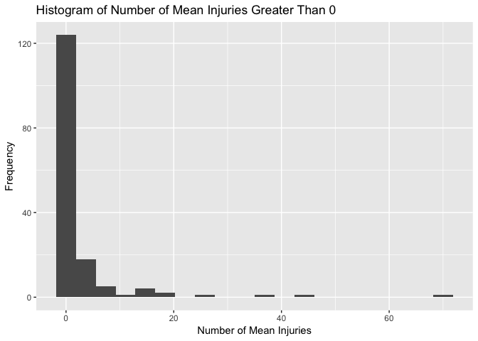
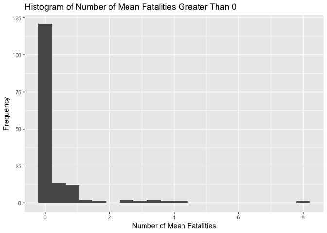
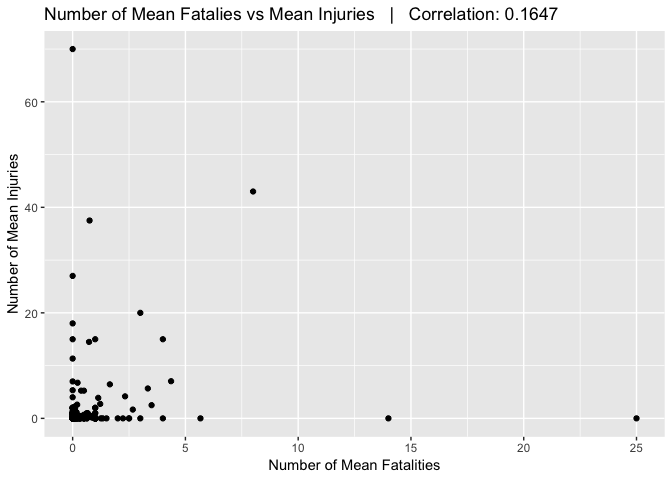

#Synopsis

On this project, we want to use data in order to address the following:

1. Across the United States, which types of events (as indicated in the \color{red}{\verb|EVTYPE|}EVTYPE variable) are most harmful with respect to population health?
  
  * Storms and heat waves are the most harmful to population health.

2. Across the United States, which types of events have the greatest economic consequences?

  * Storms that generate high winds and flooding are the main cause of most damage cost. Flooding is the main cause for the most property and crop damage.
  
In order to complete the analysis, we used Injuries and Fatalities variables as metrics that help describe impact to population health.  At the same time, we used Property and Crop Damage variables as the two metrics that help describe economic impact.  The data processing is divided in two sections in order address each question.


###Data Processing | Population health

Before understanding the data, let's download the data file and load it into a variable.


```r
library(tidyverse)
library(ggplot2)
```

```r
temp <- tempfile()
download.file("https://d396qusza40orc.cloudfront.net/repdata%2Fdata%2FStormData.csv.bz2",temp)
data <- read.csv(temp, header=T, sep=",",row.names=NULL)
```

Let's explore the features included in the data set:

```r
### feature names
colnames(data)
```

```
##  [1] "STATE__"    "BGN_DATE"   "BGN_TIME"   "TIME_ZONE"  "COUNTY"    
##  [6] "COUNTYNAME" "STATE"      "EVTYPE"     "BGN_RANGE"  "BGN_AZI"   
## [11] "BGN_LOCATI" "END_DATE"   "END_TIME"   "COUNTY_END" "COUNTYENDN"
## [16] "END_RANGE"  "END_AZI"    "END_LOCATI" "LENGTH"     "WIDTH"     
## [21] "F"          "MAG"        "FATALITIES" "INJURIES"   "PROPDMG"   
## [26] "PROPDMGEXP" "CROPDMG"    "CROPDMGEXP" "WFO"        "STATEOFFIC"
## [31] "ZONENAMES"  "LATITUDE"   "LONGITUDE"  "LATITUDE_E" "LONGITUDE_"
## [36] "REMARKS"    "REFNUM"
```

After reviewing the documentation, I decided to use injuries and fatalities as metrics that will help identify most harmful events to population health.  Also, I will group these two by event type and aggregate them with the mean value of these variables. This transformation will help us understand how each event impacts each variable in average considering they occur in different locations, time and date, for example. 


```r
## events
#unique(data$EVTYPE)

head(table(data$EVTYPE)[order(table(data$EVTYPE),decreasing = TRUE)],20)
```

```
## 
##                     HAIL                TSTM WIND        THUNDERSTORM WIND 
##                   288661                   219940                    82563 
##                  TORNADO              FLASH FLOOD                    FLOOD 
##                    60652                    54277                    25326 
##       THUNDERSTORM WINDS                HIGH WIND                LIGHTNING 
##                    20843                    20212                    15754 
##               HEAVY SNOW               HEAVY RAIN             WINTER STORM 
##                    15708                    11723                    11433 
##           WINTER WEATHER             FUNNEL CLOUD         MARINE TSTM WIND 
##                     7026                     6839                     6175 
## MARINE THUNDERSTORM WIND               WATERSPOUT              STRONG WIND 
##                     5812                     3796                     3566 
##     URBAN/SML STREAM FLD                 WILDFIRE 
##                     3392                     2761
```

```r
###
summary(data$FATALITIES)
```

```
##     Min.  1st Qu.   Median     Mean  3rd Qu.     Max. 
##   0.0000   0.0000   0.0000   0.0168   0.0000 583.0000
```

```r
summary(data$INJURIES)
```

```
##      Min.   1st Qu.    Median      Mean   3rd Qu.      Max. 
##    0.0000    0.0000    0.0000    0.1557    0.0000 1700.0000
```

```r
data4analysis <- data %>%
  select(EVTYPE,FATALITIES,INJURIES) %>%
  group_by(EVTYPE) %>%
  summarise(meanFatal = mean(FATALITIES), meanInj = mean(INJURIES))

summary(data4analysis)
```

```
##                    EVTYPE      meanFatal          meanInj       
##     HIGH SURF ADVISORY:  1   Min.   : 0.0000   Min.   : 0.0000  
##   COASTAL FLOOD       :  1   1st Qu.: 0.0000   1st Qu.: 0.0000  
##   FLASH FLOOD         :  1   Median : 0.0000   Median : 0.0000  
##   LIGHTNING           :  1   Mean   : 0.1525   Mean   : 0.4297  
##   TSTM WIND           :  1   3rd Qu.: 0.0000   3rd Qu.: 0.0000  
##   TSTM WIND (G45)     :  1   Max.   :25.0000   Max.   :70.0000  
##  (Other)              :979
```

Let's look at different histograms of the **INJURIES** feature in order to understand better how the data varies:

```r
for (eachThreshold in c(0)){
  
  # print(qplot(data$INJURIES[data$INJURIES>eachThreshold],geom="histogram",bins = 20) +
  #   xlab("Number of Injuries") + ylab("Frequency") + 
  #   ggtitle(paste("Histogram of Number of Injuries Greater Than",eachThreshold)))
  
  print(qplot(data4analysis$meanInj[data4analysis$meanInj>eachThreshold],geom="histogram",bins = 20) +
    xlab("Number of Mean Injuries") + ylab("Frequency") + 
    ggtitle(paste("Histogram of Number of Mean Injuries Greater Than",eachThreshold)))
  
}
```

<!-- -->

It helps looking at the number of injuries that are greater than 0.  This will help us focus on the highest number of mean injuries while we identify events that are most harmful to population health.

Now, let's do the same for number of **FATALITIES**.

```r
for (eachThreshold in c(0)){
  
  print(qplot(data4analysis$meanFatal[data4analysis$meanInj>eachThreshold],geom="histogram",bins = 20) +
    xlab("Number of Mean Fatalities") + ylab("Frequency") + 
    ggtitle(paste("Histogram of Number of Mean Fatalities Greater Than",eachThreshold)))
  
}
```

<!-- -->

With Fatalities, I propose considering fatalities greater than 0 as a metric that will help us identify those events that affect the population health.

Moving forward, lets look at the correlation between these two features.

```r
library(reshape2)
ggplot(data4analysis,aes(x=meanFatal,y=meanInj)) +
  geom_point() + xlab("Number of Mean Fatalities") + ylab("Number of Mean Injuries")  +
  ggtitle(paste("Number of Mean Fatalies vs Mean Injuries   |   Correlation:",round(cor(data4analysis$meanFatal,data4analysis$meanInj),4)))
```

<!-- -->

There is low positive correlation between Fatalities and Injuries.  

Now, let's identify which events are the most harmful by looking at the events with most fatalities and most injuries using the thresholds we defined earlier.

* Identify those rows that have mean injuries/fatalities greater than 0 and filtered them.

```r
highMeanInjFat <- data4analysis %>%
  mutate(highInjuryFatality = (meanInj>0&meanFatal>0)) %>%
  filter(highInjuryFatality == TRUE)
```

* Get Top 10 events with the highest mean fatalities that also had high number of mean injuries.  I'm counting the number of times a top fatality/injury is seen for each one in order to identify which events was in the top for both.  Then, will sort by the mean of Fatalities to get the final top 10.

```r
## init count 0
highMeanInjFat[,"top10"] <-0
## display top 7 for each variable
head(highMeanInjFat[order(highMeanInjFat$meanFatal,decreasing = TRUE),],7)
```

```
## # A tibble: 7 x 5
##   EVTYPE                meanFatal meanInj highInjuryFatality top10
##   <fct>                     <dbl>   <dbl> <lgl>              <dbl>
## 1 TROPICAL STORM GORDON      8      43    TRUE                   0
## 2 EXTREME HEAT               4.36    7.05 TRUE                   0
## 3 HEAT WAVE DROUGHT          4      15    TRUE                   0
## 4 MARINE MISHAP              3.5     2.5  TRUE                   0
## 5 WINTER STORMS              3.33    5.67 TRUE                   0
## 6 HIGH WIND AND SEAS         3      20    TRUE                   0
## 7 ROUGH SEAS                 2.67    1.67 TRUE                   0
```

```r
head(highMeanInjFat[order(highMeanInjFat$meanInj,decreasing = TRUE),],7)
```

```
## # A tibble: 7 x 5
##   EVTYPE                  meanFatal meanInj highInjuryFatality top10
##   <fct>                       <dbl>   <dbl> <lgl>              <dbl>
## 1 TROPICAL STORM GORDON       8       43    TRUE                   0
## 2 WILD FIRES                  0.75    37.5  TRUE                   0
## 3 HIGH WIND AND SEAS          3       20    TRUE                   0
## 4 HEAT WAVE DROUGHT           4       15    TRUE                   0
## 5 WINTER STORM HIGH WINDS     1       15    TRUE                   0
## 6 HURRICANE/TYPHOON           0.727   14.5  TRUE                   0
## 7 EXTREME HEAT                4.36     7.05 TRUE                   0
```

```r
## For each variable add 1 in the top10 column if they were in the top 50
highMeanInjFat[order(highMeanInjFat$meanFatal,decreasing = TRUE)[1:50],"top10"] <-highMeanInjFat[order(highMeanInjFat$meanFatal,decreasing = TRUE)[1:50],"top10"]+1
highMeanInjFat[order(highMeanInjFat$meanInj,decreasing = TRUE)[1:50],"top10"] <-highMeanInjFat[order(highMeanInjFat$meanInj,decreasing = TRUE)[1:50],"top10"]+1

## filter by top10 column to get only those rows that were in both top 50 lists.
top10 <- highMeanInjFat %>%
  filter(top10 ==2)

## Get the top 10
top10Health <- head(top10[order(top10$meanFatal,decreasing = TRUE),],10)
print(top10Health)
```

```
## # A tibble: 10 x 5
##    EVTYPE                meanFatal meanInj highInjuryFatality top10
##    <fct>                     <dbl>   <dbl> <lgl>              <dbl>
##  1 TROPICAL STORM GORDON      8      43    TRUE                   2
##  2 EXTREME HEAT               4.36    7.05 TRUE                   2
##  3 HEAT WAVE DROUGHT          4      15    TRUE                   2
##  4 MARINE MISHAP              3.5     2.5  TRUE                   2
##  5 WINTER STORMS              3.33    5.67 TRUE                   2
##  6 HIGH WIND AND SEAS         3      20    TRUE                   2
##  7 ROUGH SEAS                 2.67    1.67 TRUE                   2
##  8 HEAT WAVE                  2.32    4.18 TRUE                   2
##  9 TSUNAMI                    1.65    6.45 TRUE                   2
## 10 HEAT                       1.22    2.74 TRUE                   2
```

## Data Processing | Economic impact

Using property damage and crop damage variables, will help us identify event types that have the greatest economic consequences.  We are transforming the damage account for each variable following the exponential provided in the **PROPDMGEXP/CROPDMGEXP** (exponential/units) variable.


```r
##### economy
### adjusting Property and Crop damage dollar amounts with their exponential units and then adding them together.
econData <- data %>%
  filter(PROPDMG>0 & CROPDMG>0 ) %>%
  mutate(adjPropDmg=
           if_else(PROPDMGEXP=="B",PROPDMG*1e8,
              if_else(PROPDMGEXP=="M"|PROPDMGEXP=="m",PROPDMG*1e6,
                if_else(PROPDMGEXP=="K"|PROPDMGEXP=="3",PROPDMG*1e3,
                      if_else(PROPDMGEXP=="5",PROPDMG*1e5, PROPDMG
                  )
              )
            )
          ),adjCropDmg= if_else(CROPDMGEXP=="B",CROPDMG*1e8,
              if_else(CROPDMGEXP=="M"|CROPDMGEXP=="m",CROPDMG*1e6,
                if_else(CROPDMGEXP=="K"|CROPDMGEXP=="k",CROPDMG*1e3,
                      if_else(CROPDMGEXP=="5",CROPDMG*1e5, CROPDMG
                  )
              )
            )
          )
        ,allDamage=adjCropDmg+adjPropDmg
        )

head(econData[,c("CROPDMG","adjCropDmg","CROPDMGEXP","PROPDMG","adjPropDmg","PROPDMGEXP","allDamage")])
```

```
##   CROPDMG adjCropDmg CROPDMGEXP PROPDMG adjPropDmg PROPDMGEXP allDamage
## 1      10      1e+07          M     0.1    1.0e+07          B   2.0e+07
## 2     500      5e+05          K     5.0    5.0e+06          M   5.5e+06
## 3       1      1e+06          M    25.0    2.5e+07          M   2.6e+07
## 4       4      4e+06          M    48.0    4.8e+07          M   5.2e+07
## 5      10      1e+07          m    20.0    2.0e+07          m   3.0e+07
## 6      50      5e+04          K    50.0    5.0e+04          K   1.0e+05
```

```r
# unique(econData$PROPDMGEXP)
# unique(econData$CROPDMGEXP)
```

After combining the property and crop damage in one column we can find the top events that create the most economic impact.


```r
top10econ <- head(econData[order(econData$allDamage,decreasing = TRUE),c("EVTYPE","allDamage")],10)
print(top10econ)
```

```
##                  EVTYPE   allDamage
## 11026             FLOOD 11532500000
## 9464          HIGH WIND  1104000000
## 172         RIVER FLOOD  1000000000
## 6485              FLOOD   950000000
## 9463  HURRICANE/TYPHOON   827000000
## 6367          HURRICANE   824220000
## 6370          HURRICANE   800000000
## 10816 HURRICANE/TYPHOON   739000000
## 9465  HURRICANE/TYPHOON   711000000
## 14088 THUNDERSTORM WIND   700200000
```


#Results

### First Question:

* We can identify that these 10 events are the ones that are the most harmful to population health:


```r
print(top10Health)
```

```
## # A tibble: 10 x 5
##    EVTYPE                meanFatal meanInj highInjuryFatality top10
##    <fct>                     <dbl>   <dbl> <lgl>              <dbl>
##  1 TROPICAL STORM GORDON      8      43    TRUE                   2
##  2 EXTREME HEAT               4.36    7.05 TRUE                   2
##  3 HEAT WAVE DROUGHT          4      15    TRUE                   2
##  4 MARINE MISHAP              3.5     2.5  TRUE                   2
##  5 WINTER STORMS              3.33    5.67 TRUE                   2
##  6 HIGH WIND AND SEAS         3      20    TRUE                   2
##  7 ROUGH SEAS                 2.67    1.67 TRUE                   2
##  8 HEAT WAVE                  2.32    4.18 TRUE                   2
##  9 TSUNAMI                    1.65    6.45 TRUE                   2
## 10 HEAT                       1.22    2.74 TRUE                   2
```

* Heat wave and storms are the most significant of all 10 events.

### Second Question:

* We find that these 10 events are the ones that have the greatest economic consequences:


```r
print(top10econ)
```

```
##                  EVTYPE   allDamage
## 11026             FLOOD 11532500000
## 9464          HIGH WIND  1104000000
## 172         RIVER FLOOD  1000000000
## 6485              FLOOD   950000000
## 9463  HURRICANE/TYPHOON   827000000
## 6367          HURRICANE   824220000
## 6370          HURRICANE   800000000
## 10816 HURRICANE/TYPHOON   739000000
## 9465  HURRICANE/TYPHOON   711000000
## 14088 THUNDERSTORM WIND   700200000
```

* Storms that generate high winds and flooding are the main cause of most damage cost.  Flooding is the main cause for the most property and crop damage. 
